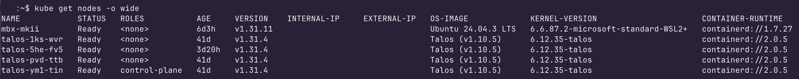
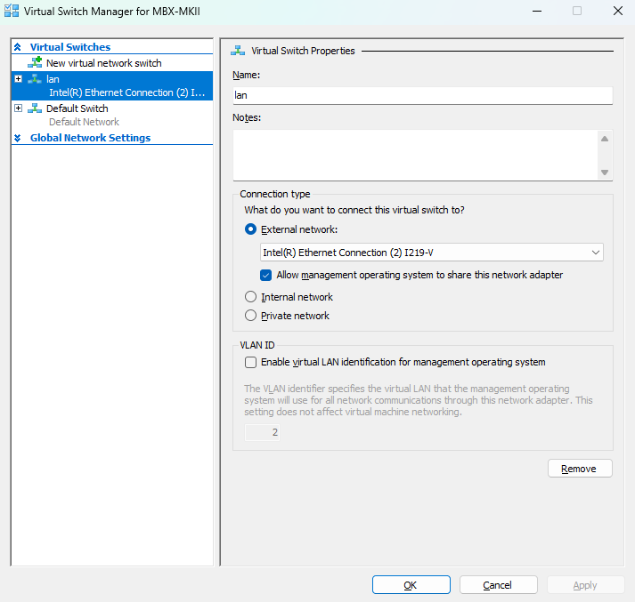

## Keres

Talos whips when you're an enterprise that wants to slap together a bunch of bare metal and virtual machines running talos linux into a kubernetes cluster.

Talos does not whip when you're just someone who wants to add their gaming PCs to their talos managed kubernetes cluster without having to give up the functionality of being able to use their GPU rigs as workstations, remote development GPU nodes, or overglorified xboxs. That's why I built Keres.

Keres is a set of scripts and documentation to help you add kubelets running on Windows Sub Linux to your talos managed kubernetes cluster with support for nvme drives and networked filesystems and has four major components.

* Bridge network setup with generated Mac Address support
* Kernel WSL2 compilation for ISCSI and NVME support
* Install k8s tooling, config kubelet, and join cluster
* Post install powershell scripts to config and set task to automount ext4 drives to WSL2 on user login plus teardown


If you follow these instructions and everything goes right then you may end up seeing something like this when you run `kubectl get nodes -o wide`



## Table of Contents
- [Prerequisites](#prerequisites)
- [Creating a Bridge Network](#creating-a-bridge-network)
- [Compiling a Custom Kernel](#compile-custom-kernel)
- [Attaching our Bridge Network and Custom Kernel using wslconfig](#attach-bridge-network-and-custom-kernel-using-wslconfig)
- [Installing Docker Desktop as DockerDesktop](#install-docker-desktop-as-dockerdesktop)
- [Install kubead, kubectl, talosctl](#install-kubead-kubectl-talosctl)
- [Copy talos config to new machine](#copy-talos-config-to-new-machine)
- [Run join script with talos config to pull needed configs and credentials](#run-join-script-with-talos-config-to-pull-needed-configs-and-credentials)
- [Troubleshoot CNI](#troubleshoot-cni)
- [Restart Kubelet and connect to cluster](#restart-kubelet-and-connect-to-cluster)
- [Reinstall vscode and codeserver if remotely connecting to code server](#reinstall-vscode-and-codeserver-if-remotely-connecting-to-code-server)

## Prerequisites
To seamlessly run Keres you'll need:

1. A working talos managed kubernetes cluster
2. A windows machine running WSL2 with Ubuntu 24.04.3 LTS installed
3. Hyper-V enabled (run `Enable-WindowsOptionalFeature -Online -FeatureName Microsoft-Hyper-V -All` from admin powershell and reboot if not already enabled)
4. Hyper-V managed virtual switch named `wsl-lan`
4. A working talos config from another machine copied into ~/.talos/config on Ubuntu running within WSL2
5. A Keres config at `~/.keres` in windows that will tell Keres which ext4 drives to automount to WSL on login to Windows (optional)

The main script will run this pre-flight check and will warn you if anything is missing or prompt you to let you to config or enable things that it can fix.


## Creating a Bridge Network

Keres automaticallys create a hyper-v managed virtual switch called wsl2-lan and attaches to WSL2 via your Window's host's ~/.wslconfig

Even though Microsoft is deprecating bridge networks in WSL2 we have to use a bridge network because the default network can't access your lan network and the mirrored network requires you to open and manage ports on both the windows host and wsl2 for anything to work.

A bridge network will bridge our WSL2 instance through the windows host straight onto the lan with it's own proper ip address. This won't mess up any other networked services and will only require you to config ports occassionally on WSL2.

This part of preflight script is a little jank so if it doesn't work you can set it up by hand using hyper-v or from powershell running as admin



You can also do this with powershell while running as administrator

If you haven't enabled hyper-v already, enable it, it may ask you to restart to enable:

```
Enable-WindowsOptionalFeature -Online -FeatureName Microsoft-Hyper-V -All
```

If you do know your NetAdapterName (will probably work as is)
```
New-VMSwitch -Name "wsl-lan" -NetAdapterName "Ethernet" -AllowManagementOS $true
```


## Compiling Your Own WSL2 Kernel

Remember that screenshot where I showed all the nodes in my kubernetes cluster?


If you look closely you'll notice that it lists the kernel each node uses and they're all talos except for the one running windows. `6.6.87.2-microsoft-standard-WSL2+` to be exact.

That little `+` means that the kernel was compiled and added by hand. This is how we include iscsi for attached network storage and native nvme support for WSL2.

Don't worry too much about the specifics since I've automated this for us with a script and configs we'll apply in the next section.